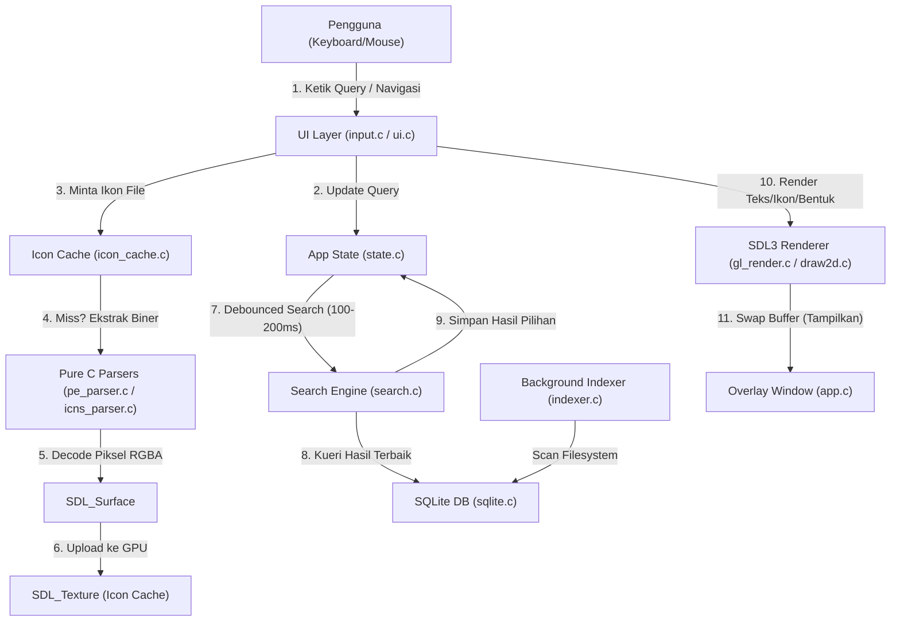

# Cross-Platform Spotlight Clone

[](https://en.cppreference.com/w/c)
[](https://www.libsdl.org)
[](https://www.sqlite.org)
[](https://cmake.org)

**Cross-Platform Spotlight Clone** adalah aplikasi antarmuka pencarian cepat (*desktop overlay launcher*) berbasis bahasa pemrograman **C**, **SDL3** untuk manajemen jendela, event, dan input, serta **SQLite** untuk database pencarian lokal yang sangat cepat.

Aplikasi ini meniru antarmuka visual macOS Spotlight Search secara fungsional: melakukan pencarian real-time dengan pencocokan teroptimasi, serta merender hasil pencarian lengkap dengan ikon asli berkas dari sistem operasi (*native OS icons*) melalui ekstraksi parser biner mandiri.

---

## 🏗️ Arsitektur Hubungan Sistem

Berikut adalah diagram alur data dan interaksi antarmuka pengguna pada sistem Spotlight Clone:



---

## ⚡ Fitur Utama

- 🔍 **Pencarian SQLite Real-Time**: Pencarian secepat kilat dengan pencocokan string terindeks dan kueri teroptimasi.
- 🕒 **Sistem Debouncing Input**: Menunda eksekusi kueri SQLite selama 100-200ms setelah selesai mengetik untuk menghindari *disk overhead* yang membebani CPU.
- 🎨 **Ekstraksi Ikon Native Lintas Platform (Pure C)**: Mengurai dan mengekstrak ikon langsung dari biner Portable Executable (Windows `.exe`/`.dll`) dan format macOS `.icns` menggunakan parser C murni buatan sendiri ([pe_parser.c](src/icon/pe_parser.c) dan [icns_parser.c](src/icon/icns_parser.c)), menghilangkan ketergantungan API berat seperti Cocoa atau Win32 GUI Shell.
- 💾 **GPU Texture Caching**: Mengubah pixel buffer ikon menjadi `SDL_Texture` sekali saja dan menyimpannya di memori VRAM GPU untuk rendering instan tanpa lag transfer data CPU-GPU.
- 🔤 **Native OS Text Rendering**: Merender font sistem secara dinamis dengan kualitas tinggi (*antialiasing* native OS) serta mendukung karakter Unicode (UTF-8) penuh secara luwes.

---

## 🎨 Alur Rendering Grafis & Pipeline Grafika

Sebagai aplikasi yang menekankan efisiensi tinggi pada antarmuka pengguna, Spotlight Clone mengimplementasikan berbagai konsep dasar Grafika Komputer melalui API SDL3:

### 1. Hardware-Accelerated Graphics Context
Aplikasi ini mengikat jendela ke GPU melalui `SDL_Renderer`. Di latar belakang, SDL3 secara otomatis memilih API grafis terakselerasi perangkat keras (*hardware-accelerated backend*) yang paling optimal untuk platform yang sedang berjalan:
- **macOS**: Menggunakan **Metal API**.
- **Windows**: Menggunakan **Direct3D 11/12** atau **OpenGL**.
- **Linux**: Menggunakan **OpenGL** atau **Vulkan**.

### 2. Double Buffering & VSync (SwapBuffers)
Untuk menghindari distorsi visual berupa robekan layar (*screen tearing*), rendering dilakukan menggunakan teknik **Double Buffering**:
- Proses penggambaran tata letak UI (latar belakang, border, teks, ikon) dilakukan pada ruang memori grafis yang tidak terlihat, yang disebut **Back-Buffer**.
- Setelah seluruh elemen selesai digambar, fungsi `SDL_RenderPresent` dipanggil untuk menukar posisi buffer (**SwapBuffers**). Buffer yang berisi gambar baru (Back-Buffer) kini ditampilkan ke layar (Front-Buffer), disinkronisasikan dengan frekuensi penyegaran monitor (*VSync*).

### 3. Rasterisasi & Menggambar Primitif 2D
Menggambar bentuk geometri dasar secara efisien menggunakan akselerasi GPU:
- **Rounded Rectangle**: Latar belakang jendela utama dan baris sorotan digambar dengan sudut tumpul melengkung (*rounded corners*) menggunakan algoritma rasterisasi lingkaran terpotong di [src/render/draw2d.c](src/render/draw2d.c).
- **Garis Pembatas (Dividers)**: Digambar menggunakan fungsi rendering garis (`SDL_RenderLine`) untuk memisahkan search bar dengan dropdown hasil pencarian.

### 4. Alpha Blending (Transparansi Grafis)
Untuk mencapai visual modern premium, transparansi diatur melalui formula blending grafis `SDL_BLENDMODE_BLEND` pada GPU:
$$\text{Color}_{\text{result}} = (\text{Color}_{\text{src}} \times \text{Alpha}_{\text{src}}) + (\text{Color}_{\text{dst}} \times (1 - \text{Alpha}_{\text{src}}))$$
Formula ini diimplementasikan untuk merender baris sorotan (*highlight*) biru transparan (`rgba: 64, 156, 255, 120`) pada baris pencarian yang sedang dipilih pengguna.

### 5. Texture Mapping & Caching Ikon
Memindahkan aset gambar dari CPU ke GPU demi efisiensi optimal:
- Parser biner ([pe_parser.c](src/icon/pe_parser.c)) membaca file executable, mengekstrak format **DIB (Device-Independent Bitmap)** atau **PNG** mentah, dan mendekode susunan bit pixel ke memori sistem (RAM) dalam format warna `SDL_PIXELFORMAT_RGBA32` (`SDL_Surface`).
- Permukaan gambar (`SDL_Surface`) ini kemudian diunggah ke VRAM GPU menjadi `SDL_Texture` via `SDL_CreateTextureFromSurface` agar siap ditempelkan pada koordinat poligon UI (*Texture Mapping*).
- Tekstur disimpan permanen di memori GPU (*GPU Texture Caching*). Pada frame render berikutnya, GPU langsung menggambar tekstur dari memori lokalnya tanpa perlu melakukan transfer data biner ulang dari memori RAM (mencegah lag CPU-GPU I/O bottleneck).

### 6. Rasterisasi Teks Dinamis
Teks kueri dan nama aplikasi dirasterisasi secara dinamis dari sistem font native OS:
- Di Windows ([platform_text_windows.c](src/render/platform_text_windows.c)), teks UTF-8 dikonversi ke UTF-16 lalu digambar menggunakan API Windows GDI (`DrawTextW`) dengan kualitas **ClearType Antialiasing** ke memori DIB bitmap.
- Di macOS ([platform_text_macos.m](src/render/platform_text_macos.m)), teks digambar menggunakan framework Cocoa (`NSAttributedString` & `NSFont` San Francisco) ke bitmap buffer.
- Hasil rasterisasi bitmap teks ini diunggah sebagai `SDL_Texture` ke GPU dan digambar secara real-time pada search bar dan dropdown.

---

## 📁 Struktur Direktori & Tanggung Jawab

Struktur direktori proyek ini dirancang secara modular guna memisahkan tanggung jawab logika secara bersih:

| Direktori / Berkas | Tanggung Jawab (Responsibility) | File Kunci Utama |
| :--- | :--- | :--- |
| [bin/](bin/) | Menyimpan berkas biner eksekutabel hasil kompilasi. | `spotlight_search`, `SDL3.dll` (Windows) |
| [db/](db/) | Tempat penyimpanan basis data SQLite lokal. | `spotlight.db` |
| [external/](external/) | Berisi pustaka pihak ketiga yang dikelola secara lokal. | `sdl3/`, `sqlite3/`, `w64devkit/` (Windows GCC) |
| [scripts/](scripts/) | Berisi skrip otomatisasi build dan kompilasi lintas platform. | `build.sh`, `build.bat`, `setup_compiler.sh`, `setup_compiler.bat` |
| [src/core/](src/core/) | Manajemen siklus hidup aplikasi (startup, loop event, shutdown) dan state global. | `app.c`, `state.c` |
| [src/db/](src/db/) | Penghubung SQLite dan background indexer pemindaian folder lokal. | `sqlite.c`, `indexer.c` |
| [src/icon/](src/icon/) | Parser biner ikon (PE / ICNS) mandiri dan manajemen cache GPU. | `icon.c`, `icon_cache.c`, `pe_parser.c`, `icns_parser.c`, `generic_icon.c` |
| [src/platform/](src/platform/) | Fungsi pembungkus native OS (deteksi platform, pembacaan file, & eksekusi). | `detection.c`, `fs.c`, `platform.c`, `platform_macos.m` |
| [src/render/](src/render/) | Inisialisasi renderer grafis, gambar primitif 2D, dan tekstur teks native OS. | `gl_render.c`, `draw2d.c`, `platform_text_macos.m`, `platform_text_windows.c` |
| [src/search/](src/search/) | Logika pencarian kueri SQLite dan algoritma ranking berdasarkan relevansi. | `search.c`, `ranking.c` |
| [src/ui/](src/ui/) | Pemrosesan masukan keyboard, event cursor, dan rendering tata letak UI. | `ui.c`, `input.c` |

---

## 📜 Bagaimana Program Bekerja

Aplikasi berjalan dengan mengikuti alur kerja terstruktur untuk menjamin efisiensi tinggi pada setiap bagian:

### 1. Inisialisasi & Startup
Saat aplikasi dijalankan, siklus berikut akan terjadi:
- **SDL3 Initialization**: Sistem menginisialisasi subsistem video SDL3 dan membuat jendela borderless (`SDL_WINDOW_BORDERLESS`).
- **GPU Renderer Binding**: Membuat objek `SDL_Renderer` berakselerasi perangkat keras.
- **Koneksi SQLite**: Membuka berkas `db/spotlight.db`. Pada jalannya aplikasi untuk pertama kali (*first-run*), program akan membuat struktur tabel basis data dan memicu **Background Indexer**.
- **Background Indexing**: Program memindai folder sistem (`/Applications` di Mac, folder Program/Start Menu di Windows) secara asinkron untuk mendata file, path, tipe, dan platform ke database.

### 2. Siklus Event Loop
Perulangan utama (`SDL_PollEvent`) menangani input pengguna secara responsif:
- Menangkap ketikan huruf demi huruf dan memperbarui buffer query pencarian di `AppState`.
- Mendeteksi penekanan tombol navigasi keyboard (panah `↑` dan `↓` untuk memindahkan pilihan baris, tombol `Enter` untuk mengeksekusi).
- Tombol `ESC` atau klik di luar area jendela akan menyembunyikan/menutup aplikasi secara instan.

### 3. Kueri Debounced & Perankingan
Ketika teks query diinputkan, pencarian tidak langsung ditembakkan ke database pada setiap frame render (untuk mencegah lag pengetikan):
- Sistem menunggu durasi diam pengetikan selama **100-200ms**.
- Query dikirimkan ke SQLite: `SELECT ... FROM items WHERE name LIKE ? LIMIT 10`.
- Hasil pencarian diurutkan menggunakan algoritma perankingan sederhana (`ranking.c`) untuk mengevaluasi kesamaan awalan huruf (prefix matching) dan panjang kata. 5 hasil terbaik disalin ke `AppState`.

### 4. Ekstraksi Ikon Lintas Platform (Pure C)
Setiap baris hasil pencarian membutuhkan ikon aplikasi:
- UI meminta tekstur ikon ke `icon_cache`.
- Jika belum ter-cache (*cache miss*), program memanggil modul parser biner mandiri:
  - **Windows (.exe / .dll)**: Modul [pe_parser.c](src/icon/pe_parser.c) mem-parsing berkas executable, mencari direktori resource `RT_GROUP_ICON`, memilih resolusi terbaik, lalu mendekode bitmap **DIB** menjadi RGBA mentah. Jika data dalam format **PNG**, data biner langsung diekstrak.
  - **macOS (.app)**: Modul [icns_parser.c](src/icon/icns_parser.c) membaca folder bundle `/Contents/Resources/`, mencari file `.icns`, mengurainya, dan mengekstrak file biner **PNG** di dalamnya.
- Data gambar mentah (RGBA bitmap atau PNG) diubah menjadi `SDL_Surface` lalu dimuat ke GPU menjadi `SDL_Texture*`.

### 5. Eksekusi Peluncuran Aplikasi
Saat baris hasil dipilih dan tombol `Enter` ditekan, aplikasi memanggil fungsi native platform:
- macOS: Menggunakan API Cocoa untuk membuka file/aplikasi terkait di background secara bersih.
- Windows: Menggunakan instruksi `ShellExecuteW` (wide-character) guna menjamin path yang mengandung spasi atau karakter non-ASCII (Unicode) dapat diluncurkan secara aman dan sukses tanpa memicu error sistem.

---

## 🚀 Panduan Build & Eksekusi (Clone-to-Run)

### Prasyarat Sistem
- **macOS**: Memiliki compiler `clang` (biasanya terpasang otomatis saat memasang Xcode Command Line Tools).
- **Windows**: Dapat dijalankan tanpa prasyarat rumit karena semua dependensi (termasuk compiler GCC portable) akan di-setup secara otomatis.
- **Linux**: Memiliki compiler `gcc`/`clang` dan `cmake`.

### Langkah-Langkah

#### 1. Kloning Repositori
Jalankan perintah clone untuk mengunduh berkas proyek ke komputer Anda:
```bash
git clone https://github.com/faizulmushofa/atlas-launcher.git
cd spotlight_search
```

#### 2. Kompilasi & Menjalankan Proyek

##### A. Cara Satu-Klik di Windows
Cukup jalankan script orkestrator utama di root proyek Anda:
```batch
:: Melakukan konfigurasi otomatis compiler + build + langsung menjalankan aplikasi
run_windows.bat run
```
> [!TIP]
> Script `run_windows.bat` akan secara otomatis mendeteksi jika compiler portable **w64devkit (GCC)**, SQLite3, dan SDL3 versi **3.4.10** belum terpasang di folder `external`. Script akan mengunduh dan mengekstrak seluruh kebutuhan tersebut secara otomatis sebelum memulai build.

##### B. Cara di macOS / Linux
Jalankan perintah make standar di terminal Anda:
```bash
# 1. Pasang dependensi eksternal (SDL3 & SQLite) secara otomatis
make install

# 2. Kompilasi proyek menjadi biner spotlight_search di folder bin/
make build

# 3. Jalankan aplikasi
make run
```

#### 3. Bersihkan Hasil Build
Menghapus file-file sementara hasil kompilasi agar direktori kembali bersih:
- **macOS / Linux**: `make clean`
- **Windows**: `run_windows.bat clean`

---

## ⚙️ Panduan Kustomisasi Rinci

Anda dapat dengan mudah mengubah tampilan dan dimensi antarmuka Spotlight Clone dengan memodifikasi nilai konfigurasi statis pada berkas kode sumber.

### 1. Mengubah Ukuran Lebar & Tinggi Default Window
Buka berkas **[src/core/app.c](src/core/app.c)** pada fungsi `app_run()`. Anda akan melihat konfigurasi lebar default:
```c
    app_window = SDL_CreateWindow(
        "Spotlight Search",
        800,  // <--- Ubah nilai 800 ini untuk menyesuaikan lebar window (pixel)
        100,  // Tinggi awal window (akan disesuaikan secara dinamis oleh dropdown)
        SDL_WINDOW_BORDERLESS
    );
```
Untuk kustomisasi tinggi dropdown hasil pencarian, sesuaikan perhitungannya di baris berikut pada berkas yang sama (`src/core/app.c`):
```c
        // Hitung tinggi target window secara dinamis berdasarkan jumlah baris hasil
        int target_h = 50; // Tinggi search bar utama (50px)
        AppState* state = state_get();
        if (state && state->result_count > 0) {
            // 50px (search bar) + (jumlah hasil * tinggi baris 40px) + offset 10px
            target_h = 50 + (state->result_count * 40) + 10; 
        }
```

### 2. Mengubah Radius Sudut Melengkung (Rounded Corners)
Untuk menyesuaikan tingkat kelengkungan sudut jendela utama, buka berkas **[src/render/gl_render.c](src/render/gl_render.c)** di dalam fungsi `gl_render_frame()`:
```c
    // Gambar Border Luar (Radius tumpul luar 12px)
    draw2d_fill_rounded_rect(g_renderer, 0, 0, w, h, 12, border_color);

    // Gambar Latar Belakang (Radius tumpul dalam 11px, inset 1px)
    draw2d_fill_rounded_rect(g_renderer, 1, 1, w - 2, h - 2, 11, bg_color);
```

### 3. Mengubah Skema Warna Tema (Warna Latar & Border)
Skema warna didefinisikan menggunakan format `SDL_Color` (RGBA, nilai `0` hingga `255`).
- **Warna Latar Belakang & Border**: Terletak di **[src/render/gl_render.c](src/render/gl_render.c)** (`gl_render_frame()`):
  ```c
  SDL_Color border_color = { 255, 255, 255, 255 }; // Putih padat
  SDL_Color bg_color = { 20, 24, 30, 255 };       // Gelap abu-biru solid (Dark Theme)
  ```
- **Warna Teks & Elemen UI**: Terletak di **[src/ui/ui.c](src/ui/ui.c)** (`ui_render()`):
  ```c
  SDL_Color color_active = { 240, 240, 245, 255 };       // Teks aktif (Putih perak)
  SDL_Color color_placeholder = { 90, 100, 120, 255 };   // Teks placeholder (Abu-abu teredam)
  SDL_Color color_cursor = { 64, 156, 255, 255 };        // Kursor mengetik (Biru Mac Style)
  SDL_Color color_divider = { 50, 55, 65, 255 };         // Garis batas pemisah dropdown
  SDL_Color color_highlight = { 64, 156, 255, 120 };     // Sorotan baris terpilih (Biru transparan)
  ```

---

## 🧑‍💻 Penulis

* **Faizul Mushofa** - [faizulmushofa](https://github.com/faizulmushofa)
